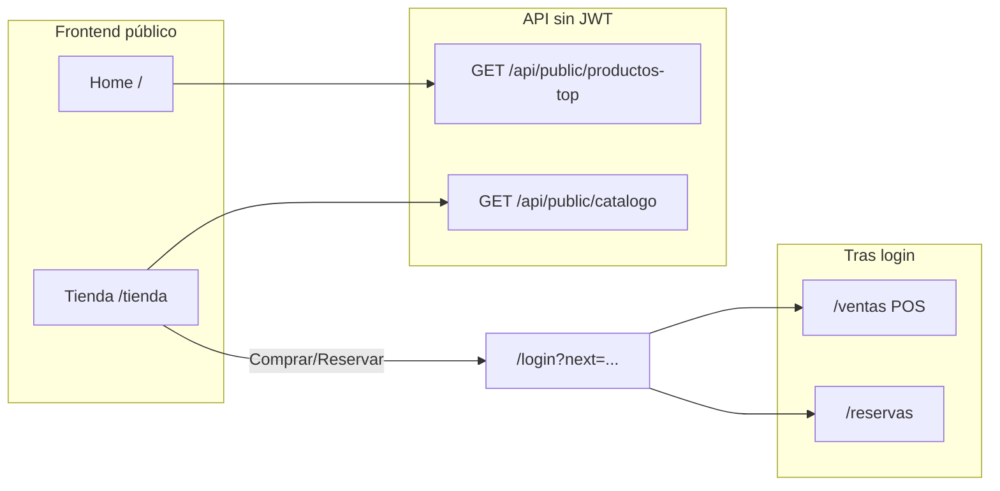

# Catálogo público y widgets CRM (vitrina + Fase 4)

## Contexto técnico actual

- El SPA ya marca rutas públicas en [`public/frontend/core/router/Router.js`](public/frontend/core/router/Router.js) (`isPublicRoute`: `'/', '/login', ...`). El bootstrap está en [`public/js/app.js`](public/js/app.js).
- **Toda la API** excepto `POST /api/auth/login` pasa por JWT en [`src/API/Router.php`](src/API/Router.php) (`handleApi` → `JwtMiddleware` → `dispatchRoutes`). Por tanto **no es posible** consumir `/api/productos` ni `/api/ventas` desde una vitrina anónima sin nuevo diseño.
- El catálogo por farmacia ya está modelado en [`src/Infrastructure/Persistence/ProductoRepository.php`](src/Infrastructure/Persistence/ProductoRepository.php) (`findAllByFarmacia`, `search`): incluye `stock_total`, `precio_activo`, `imagen`.
- Reservas y ventas reales siguen en [`src/API/routes/reservas.php`](src/API/routes/reservas.php) y [`src/API/routes/ventas.php`](src/API/routes/ventas.php) con `Auth::farmaciaId()` — coherente con la **Fase 4** del [Cronograma](docs/Documentation/Cronograma.txt) (POS + gestión interna).

Tu decisión: **vitrina + login** antes de compra/reserva; pasarela (ePayco) y registro de cliente quedan fuera de este alcance (solo copiar/UI que anticipe “próximamente” si hace falta).

## Arquitectura objetivo

## Backend (PHP)

1. **Ramas públicas antes del JWT** en [`src/API/Router.php`](src/API/Router.php): si la URI comienza por `/api/public/` y el método es permitido, despachar y **return** sin cargar `JwtMiddleware`.
2. **Nuevo archivo de rutas** [`src/API/routes/public.php`](src/API/routes/public.php) (solo handlers PHP; sin HTML/CSS embebidos).
3. **Endpoints propuestos**:
   - `GET /api/public/catalogo` — parámetros: `farmacia_id` (obligatorio), `q` opcional (delegar en `ProductoRepository::search`), paginación opcional (`limit`/`offset` acotados).
   - `GET /api/public/productos-top` — mismo `farmacia_id`; ranking por unidades vendidas agregando `detalle_ventas` → `ventas` → `lotes` → `productos` (nuevo método en [`src/Infrastructure/Persistence/VentaRepository.php`](src/Infrastructure/Persistence/VentaRepository.php), p. ej. `topProductosByFarmacia(int $farmaciaId, int $limit, ?int $days)`).
4. **Seguridad multi-tenant**: validar que `farmacia_id` pertenezca a una **lista permitida** (recomendado: variable de entorno tipo `PUBLIC_STORE_FARMACIA_IDS` con IDs separados por coma). Sin esto, cualquier ID expuesto permitiría enumeración del catálogo de otras farmacias.
5. **Respuesta**: solo datos necesarios para vitrina (nombre, presentación, categoría, precio activo, disponibilidad/stock agregado, URL de imagen). No exponer IDs de lotes ni datos internos que no se usen en público.

### Opcional CRM autenticado (dashboard)

- `GET /api/ventas/top-productos` (con JWT, farmacia desde token) reutilizando la misma consulta que el endpoint público pero sin parámetro `farmacia_id` — evita duplicar lógica en el cliente y alinea el “más vendidos” del panel con la vitrina.

## Frontend (JS/CSS/HTML separados)

1. **Nueva ruta pública SPA**: registrar `/tienda` en [`public/js/app.js`](public/js/app.js) y en `Router.isPublicRoute` en [`public/frontend/core/router/Router.js`](public/frontend/core/router/Router.js).
2. **Página**: [`public/frontend/pages/PublicStorePage.js`](public/frontend/pages/PublicStorePage.js) — monta layout tipo ecommerce (grid de cards), barra de búsqueda, estados vacío/error/carga.
3. **Módulo dedicado** (patrón existente `modules/*/Service.js` + `View.js`):
   - [`public/frontend/modules/public-store/PublicCatalogService.js`](public/frontend/modules/public-store/PublicCatalogService.js): `fetch` nativo a `/api/public/...` con **`requireAuth: false`** (no usar `httpClient.get` por defecto porque fuerza sesión); centralizar query params y manejo de errores.
   - [`public/frontend/modules/public-store/PublicStoreView.js`](public/frontend/modules/public-store/PublicStoreView.js): render de cards y listeners.
4. **Estilos**: nuevo [`public/css/public-store.css`](public/css/public-store.css) enlazado desde [`public/index.html`](public/index.html); sin estilos inline en PHP ni bloques grandes de CSS dentro de JS salvo lo mínimo que ya usa el proyecto en páginas existentes.
5. **Config**: extender [`public/frontend/core/config/env.js`](public/frontend/core/config/env.js) con `PUBLIC_STORE_FARMACIA_ID` (o lista ya resuelta en build) para que la vitrina sepa qué farmacia consultar por defecto — debe coincidir con la whitelist del servidor.
6. **Cabecera**: ampliar [`public/frontend/layout/SiteHeader.js`](public/frontend/layout/SiteHeader.js) (o variantes) para enlace “Catálogo” → `/tienda` en marketing/login según diseño actual.
7. **Home [`public/frontend/pages/HomePage.js`](public/frontend/pages/HomePage.js)**: sección “Medicamentos más solicitados” / CRM ligero que consume `GET /api/public/productos-top` + CTA “Ver catálogo completo” hacia `/tienda`; mantener coherentes animaciones y tokens visuales con [`public/css/home.css`](public/css/home.css).

## Complemento con POS y Reservas (sin nuevas transacciones anónimas)

- En cada card: botones **Comprar** / **Reservar** → `Router.navigate('/login?next=' + encodeURIComponent('/ventas'))` o `/reservas` (o `/tienda` si prefieres volver tras login); opcionalmente añadir `?highlight=` con `producto_id` para que en una iteración futura el POS pre-seleccione (no es obligatorio en el MVP si no existe aún el wiring en [`SalesPage.js`](public/frontend/pages/SalesPage.js)).

## Alineación documentación

- **Fase 4**: ventas/reservas siguen siendo operación interna autenticada.
- **Fase 5** del cronograma prevé módulo público y `/api/public/buscar`; este trabajo encaja como base del namespace `/api/public/` (búsqueda geográfica puede acoplarse después).

## Verificación manual sugerida

- Abrir `/` y `/tienda` sin `localStorage` de sesión: debe cargar catálogo y ranking sin 401.
- Pulsar Comprar/Reservar: debe ir a `/login` sin errores de Router.
- Con sesión válida: POS y reservas siguen funcionando igual; opcionalmente validar nuevo endpoint de ranking en dashboard si se implementa.
